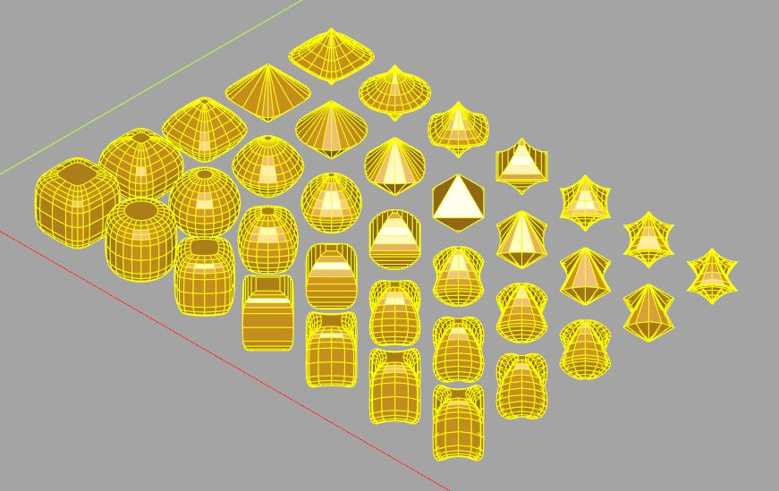

# cqMore (milestone 3)

cqMore is a [CadQuery](https://github.com/CadQuery/cadquery) plugin based on CadQuery 2.1 and Python 3.9.

## Installation

Please use `conda` to install CadQuery and its dependencies (see [Getting started](https://github.com/CadQuery/cadquery#getting-started) of CadQuery). Then, use `conda` to install `git` if you don't have it:

	conda install git
	
To install cqMore directly from GitHub, run the following `pip` command:

	pip install git+git://github.com/JustinSDK/cqMore.git

## Dependencies

This plugin has no dependencies other than the cadquery library. The [examples](examples) list their own dependencies in the first comment, if any.

## Usage

You may simply use `cqmore.Workplane` to replace `cadquery.Workplane`. For example:

    from cqmore import Workplane

    result = (Workplane()
                .rect(10, 10)
                .makePolygon(((-2, -2), (2, -2), (2, 2), (-2, 2)))
                .extrude(1)
             )

You may also attach methods of `cqmore.Workplane` to `cadquery.Workplane`, such as:

    from cadquery import Workplane
    import cqmore
    cqmore.extend(Workplane)

    result = (Workplane()
                .rect(10, 10)
                .makePolygon(((-2, -2), (2, -2), (2, 2), (-2, 2)))
                .extrude(1)
             )

## API Reference

- [`cqmore.Workplane`](docs/workplane.md)
- [`cqmore.polygon`](docs/polygon.md)
- [`cqmore.polyhedron`](docs/polyhedron.md)
- [`cqmore.curve`](docs/curve.md)
- [`cqmore.matrix`](docs/matrix.md)
