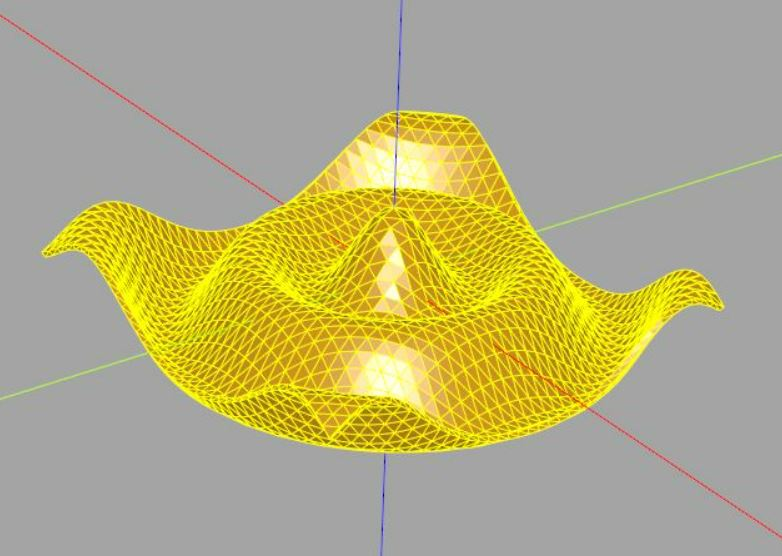

# cqMore

cqMore is a [CadQuery](https://github.com/CadQuery/cadquery) plugin (under construction).

## Installation

Please use `conda` to install CadQuery and its dependencies (see [Getting started](https://github.com/CadQuery/cadquery#getting-started) of CadQuery). Then, use `conda` to install `git` if you don't have it:

	conda install git
	
To install cqMore directly from GitHub, run the following `pip` command:

	pip install git+git://github.com/JustinSDK/cqMore.git

## Introduction

You may simply use `cqMore.Workplane` to replace `cadquery.Workplane`. For example:

    from cqMore import Workplane

    result = (Workplane()
                .rect(10, 10)
                .makePolygon(((-2, -2), (2, -2), (2, 2), (-2, 2)))
                .extrude(1)
             )

You may also attach methods of `cqMore.Workplane` to `cadquery.Workplane`, such as:

    from cadquery import Workplane
    import cqMore

    Workplane.makePolygon = cqMore.Workplane.makePolygon

    result = (Workplane()
                .rect(10, 10)
                .makePolygon(((-2, -2), (2, -2), (2, 2), (-2, 2)))
                .extrude(1)
             )

## API Reference

### 2D Operations

 Signature | Description
--|--
[`Workplane.makePolygon(points[,forConstruction])`](docs/workplane.md#makepolygonpoints-forconstruction--false) | Make a multiple sided wire from `points`.
[`Workplane.intersect2D(toIntersect)`](docs/workplane.md#intersect2dtointersect) | Intersect the provided wire from the current wire. 
[`Workplane.union2D(toUnion)`](docs/workplane.md#union2dtounion) | Union the provided wire from the current wire. 
[`Workplane.cut2D(toCut)`](docs/workplane.md#cut2dtocut) | Cut the provided wire from the current wire. 

### 3D Operations

 Signature | Description
--|--
[`Workplane.polyhedron(points,faces[,combine,clean])`](docs/workplane.md#polyhedronpoints-faces-combine--true-clean--true) | Create any polyhedron with 3D points(vertices) and faces that enclose the solid.
[`Workplane.surface(points,[thickness,combine,clean])`](docs/workplane.md#surfacepoints-thickness--0-combine--true-clean--true) | Create a surface with a coordinate meshgrid.

