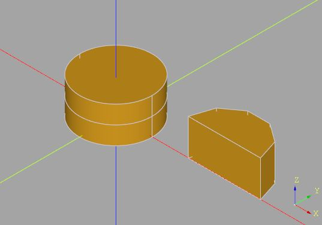
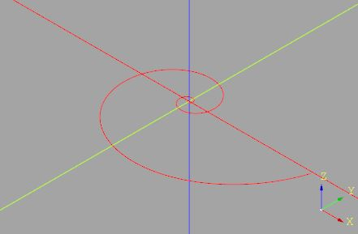
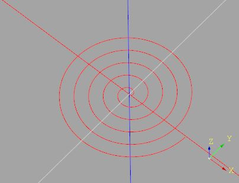
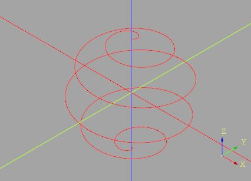
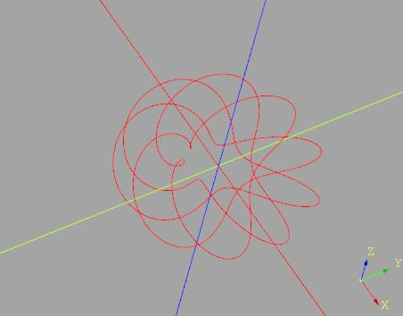

# `cqmore.curve`

Provide parametric equations of curves.

## Functions

 Signature | Description
--|--
[`circle(t,radius)`](curve.md#circle) | The parametric equation of a circle. 
[`logarithmicSpiral(t[,a,k])`](curve.md#logarithmicSpiral) | The parametric equation of a logarithmic spiral.
[`archimedeanSpiral(t,a,b)`](curve.md#archimedeanSpiral) | The parametric equation of a logarithmic spiral.  
[`helix(t,radius,slope)`](curve.md#helix) | The parametric equation of a helix.
[`sphericalSpiral(t,radius[,c])`](curve.md#sphericalSpiral) | The parametric equation of a [Spherical spiral](https://en.wikipedia.org/wiki/Spiral#Spherical_spirals).
[`torusKnot(t,p,q)`](curve.md#torusKnot) | The parametric equation of a (p,q)-torus knot.
[`parametricEquation(func[,*args,**kwargs])`](curve.md#parametricEquation) | Convert `func` into a function f(t) used by `Workplane.parametricCurve`.

----

# `circle`

The parametric equation of a circle. 

## Parameters

- `t` : a parametric variable in the range 0 to 1.
- `radius` : circle radius. 

## Examples 

    from cqmore import Workplane
    from cqmore.curve import circle

    radius = 1

    c = (Workplane()
            .parametricCurve(lambda t: circle(t, radius))
            .center(radius * 3, 0)
            .polyline([circle(t / 10, radius) for t in range(6)]).close()
            .extrude(1)
        )

# `logarithmicSpiral`

The parametric equation of a [logarithmic spiral](https://en.wikipedia.org/wiki/Logarithmic_spiral). 
Default to a golden spiral.

## Parameters

- `t`: as it increases, the point traces a right-handed spiral about the z-axis, in a right-handed coordinate system.
- `a = 1`: the a parameter of the logarithmic spiral. 
- `k = 0.306349`: the k parameter of the logarithmic spiral. 

## Examples 

    from cqmore import Workplane
    from cqmore.curve import logarithmicSpiral

    spiral = (Workplane()
                .polyline([logarithmicSpiral(t / 360) for t in range(360 * 5)])
             )

# `archimedeanSpiral`

The parametric equation of a [archimedean spiral](https://en.wikipedia.org/wiki/Archimedean_spiral). 

## Parameters

- `t`: as it increases, the point traces a right-handed spiral about the z-axis, 
        in a right-handed coordinate system.
- `a`: move the centerpoint of the spiral outward from the origin. 
- `b`: control the distance between loops.

## Examples 

    from cqmore import Workplane
    from cqmore.curve import archimedeanSpiral

    spiral = (Workplane()
                .polyline([archimedeanSpiral(t / 360, 1, 1) for t in range(360 * 5)])
            )

# `helix`

The parametric equation of a helix.

## Parameters

- `t` : as it increases, the point traces a right-handed helix about the z-axis, in a right-handed coordinate system.
- `radius`: the helix radius. 
- `slope `: the helix slope. 

## Examples 

    from cqmore import Workplane
    from cqmore.curve import helix

    radius = 1
    slope = 1

    c = (Workplane()
            .parametricCurve(lambda t: helix(t, radius, slope), stop = 3)
        )

# `sphericalSpiral`

The parametric equation of a [Spherical spiral](https://en.wikipedia.org/wiki/Spiral#Spherical_spirals).

## Parameters

- `t`: as it increases, the point traces a right-handed helix about the z-axis, 
        in a right-handed coordinate system.
- `radius`: the sphere radius. 
- `c = 2`: equal to twice the number of turns. 

## Examples 

    from cqmore import Workplane
    from cqmore.curve import sphericalSpiral

    radius = 10
    c = 10

    spiral = (Workplane()
                .parametricCurve(lambda t: sphericalSpiral(t, radius, c))
            )

# `torusKnot`

The parametric equation of a [torus knot](https://en.wikipedia.org/wiki/Torus_knot).

## Parameters

- `t` : a parametric variable in the range 0 to 1.
- `p`: the p parameter of the (p,q)-torus knot.
- `q `: the q parameter of the (p,q)-torus knot.

## Examples 

    from cqmore import Workplane
    from cqmore.curve import torusKnot

    p = 11
    q = 13

    c = (Workplane()
            .polyline([torusKnot(t / 360, p, q) for t in range(360)])
            .close()
        )

# `parametricEquation`

Convert `func` into a function f(t) used by `Workplane.parametricCurve`.

## Parameters

- `func`: the parametric equation of a curve.
- `*args`: the positional arguments.
- `**kwargs`: the keyword arguments.

## Examples 

    from cqmore import Workplane
    from cqmore.curve import torusKnot, parametricEquation

    p = 4
    q = 9

    c = (Workplane()
            .parametricCurve(parametricEquation(torusKnot, p = p, q = q))
        )

