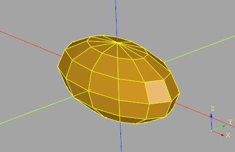
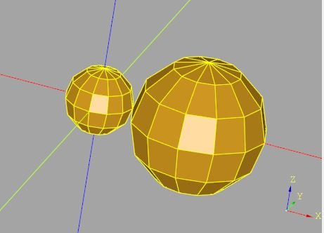
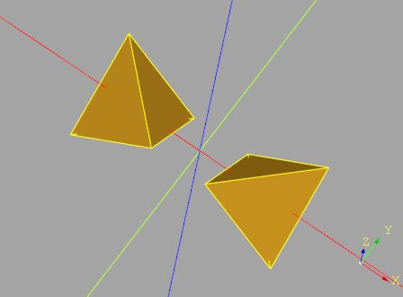
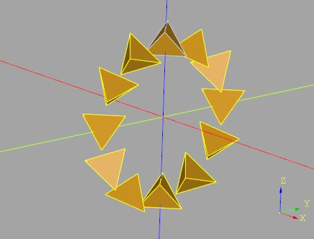
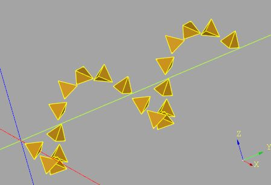
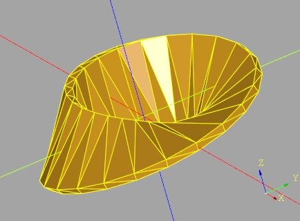
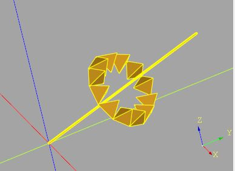

# `cqmore.matrix`

Provide the `Matrix3D` class and functions for performing matrix and vector operations. Here's an example to build a translation matrix for translating a point.

    from cqmore.matrix import translation

    point = (10, 10, 10)
    m = translation((10, 0, 0))    # return a Matrix3D instance
    new_point = m.transform(point) # (20, 10, 10)

`Matrix3D` supports matrix multiplication. You can combine multiple transformations in a single matrix. Say you have a point (10, 0, 0) and you want to translate it by (5, 0, 0) and then rotate it around the z-axis by 45 degrees. You can do it like:

    from cqmore.matrix import translation, rotationZ

    point = (10, 0, 0)
    m = rotationZ(45) @ translation((5, 0, 0))
    new_point = m.transform(point) 

The right-most matrix is first multiplied with the point so you should read the multiplications from right to left. 

## Classes

 Signature | Description
--|--
[`Matrix3D(m)`](matrix.md#matrix3d) | Create a matrix from an array-like object.

## `Matrix3D` Operations

 Signature | Description
--|--
[`transform(point)`](matrix.md#transform) | Use the current matrix to transform a point.
[`transformAll(points)`](matrix.md#transformall) | Use the current matrix to transform a list of points.

## Functions

 Signature | Description
--|--
[`identity()`](matrix.md#identity) | Create an identity matrix.
[`scaling(v)`](matrix.md#scaling) | Create a scaling matrix.
[`translation(v)`](matrix.md#translation) | Create a translation matrix.
[`mirror(v)`](matrix.md#mirror) | Create a mirror matrix.
[`rotationX(angle)`](matrix.md#rotationX) | Create a rotation matrix around the x-axis.
[`rotationY(angle)`](matrix.md#rotationY) | Create a rotation matrix around the y-axis.
[`rotationZ(angle)`](matrix.md#rotationZ) | Create a rotation matrix around the z-axis.
[`rotation(direction, angle)`](matrix.md#rotation) | Create a rotation matrix around the given direction.

----

# `Matrix3D`

Create a matrix from an array-like object.

## Parameters

- `m`: an array-like object.

## Examples 

    from cqmore.matrix import Matrix3D

    v = (5, 5, 5)

    # Create a translation matrix
    translation = Matrix3D([
        [1, 0, 0, v[0]],
        [0, 1, 0, v[1]],
        [0, 0, 1, v[2]],
        [0, 0, 0, 1]
    ])

# `transform`

Use the current matrix to transform a point.

## Parameters

- `point`: the point to transform.

## Examples 

    from cqmore.matrix import Matrix3D

    translation = Matrix3D([
        [1, 0, 0, 5],
        [0, 1, 0, 5],
        [0, 0, 1, 5],
        [0, 0, 0, 1]
    ])

    point = (10, 20, 30)
    translated = translation.transform(point) # (15, 25, 35)

# `transformAll`

Use the current matrix to transform a list of points.

## Parameters

- `points`: a list of points to transform.

## Examples 

    from cqmore.matrix import Matrix3D

    translation = Matrix3D([
        [1, 0, 0, 5],
        [0, 1, 0, 5],
        [0, 0, 1, 5],
        [0, 0, 0, 1]
    ])

    points = [(10, 20, 30), (0, 0, 0), (-10, -20, -30)]

    # ((15, 25, 35), (5, 5, 5), (-5, -15, -25))
    translated = translation.transformAll(points) 

# `identity`

Create an identity matrix.

## Examples 

    from cqmore.matrix import identity

    m = identity()

# `scaling`

Create a scaling matrix.

## Parameters

- `v`: scaling vector.

## Examples 

    from cqmore.matrix import scaling
    from cqmore.polyhedron import uvSphere
    from cqmore import Workplane

    sphere = uvSphere(1, widthSegments = 12, heightSegments = 6)

    m = scaling((2, 1, 1)) 
    scaled_points = m.transformAll(sphere.points)

    r = Workplane().polyhedron(scaled_points, sphere.faces)

# `translation`

Create a translation matrix.

## Parameters

- `v`: translation vector.

## Examples 

    from cqmore.matrix import scaling, translation
    from cqmore.polyhedron import uvSphere
    from cqmore import Workplane

    sphere = uvSphere(1, widthSegments = 12, heightSegments = 6)

    r1 = Workplane().polyhedron(*sphere)
    s = scaling((2, 2, 2)) 
    t = translation((3, 0, 0))

    transformed_pts = (t @ s).transformAll(sphere.points)
    r2 = Workplane().polyhedron(transformed_pts, sphere.faces)

# `mirror`

Create a mirror matrix.

## Parameters

- `v`: mirror vector.

## Examples 

    from cqmore.matrix import mirror, translation
    from cqmore.polyhedron import tetrahedron
    from cqmore import Workplane

    t = tetrahedron(1)

    pts = translation((1, 0, 0)).transformAll(t.points)
    r1 = Workplane().polyhedron(pts, t.faces)

    mirrored_pts = mirror((1, 0, 0)).transformAll(pts)
    r2 = Workplane().polyhedron(mirrored_pts, t.faces)

# `rotationX`

Create a rotation matrix around the x-axis.

## Parameters

- `angle`: angle degrees.

## Examples 

    from cqmore.matrix import translation, rotationX
    from cqmore.polyhedron import tetrahedron
    from cqmore import Workplane

    t = tetrahedron(1)
    pts = translation((0, 3, 0)).transformAll(t.points)

    for a in range(0, 360, 30):
        rotated_pts = rotationX(a).transformAll(pts)
        show_object(Workplane().polyhedron(rotated_pts, t.faces))

# `rotationY`

Create a rotation matrix around the y-axis.

## Parameters

- `angle`: angle degrees.

## Examples 

    from cqmore.matrix import translation, rotationY
    from cqmore.polyhedron import tetrahedron
    from cqmore import Workplane

    t = tetrahedron(1)

    for i in range(20):
        rotated_pts = (rotationY(i * 36) @ translation((3, i, 0))).transformAll(t.points)
        show_object(Workplane().polyhedron(rotated_pts, t.faces))

# `rotationZ`

Create a rotation matrix around the z-axis.

## Parameters

- `angle`: angle degrees.

## Examples 

    from cqmore import Workplane
    from cqmore.matrix import translation, rotationX, rotationZ
    from cqmore.polyhedron import sweep

    def mobius_strip(radius, frags):
        profile = [(10, -1, 0), (10, 1, 0), (-10, 1, 0), (-10, -1, 0)]

        translationX20 = translation((radius, 0, 0))
        rotationX90 = rotationX(90)

        angle_step = 360 / frags
        profiles = []
        for i in range(frags):
            m = rotationZ(i * angle_step) @ translationX20 @ rotationX90 @ rotationZ(i * angle_step / 2)
            profiles.append(m.transformAll(profile))

        return Workplane().polyhedron(*sweep(profiles, closeIdx = 2))

    radius = 20
    frags = 24

    strip = mobius_strip(radius, frags)

# `rotation`

Create a rotation matrix around the given direction.

## Parameters

- `direction`: axis of rotation.
- `angle`: angle degrees.

## Examples 

    from cqmore.matrix import rotation, translation, rotationY
    from cqmore.polyhedron import tetrahedron
    from cqmore import Workplane

    t = tetrahedron(1)
    pts = translation((6, 6, 3)).transformAll(t.points)
    direction = (10, 10, 10)

    for a in range(0, 360, 30):
        rotated_pts = rotation(direction, a).transformAll(pts)
        show_object(Workplane().polyhedron(rotated_pts, t.faces))

    show_object(
        Workplane().polylineJoin(
            [(0, 0, 0), direction], 
            Workplane().box(.1, .1, .1)
        )
    )

