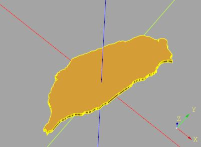
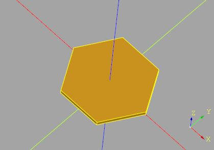
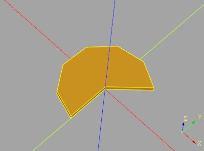
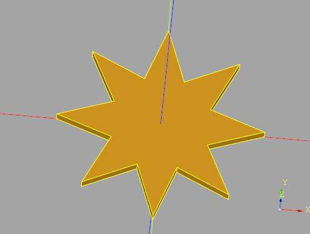

# `cqmore.polygon`

Provide functions for creating simple polygons.

## Functions

 Signature | Description
--|--
[`taiwan(h[,distance])`](polygon.md#taiwan) | Create a convex hull through the provided points. 
[`regularPolygon(nSides,radius[,thetaStart,thetaEnd])`](polygon.md#regularPolygon) | Create a regular polygon.
[`star([outerRadius,innerRadius,n])`](polygon.md#star) | Create a star.
[`hull2D(points)`](polygon.md#hull2D) | Create a convex hull through the provided points. 

----

# `taiwan`

Create a Taiwan profile.

## Parameters

- `h` : The height of Taiwan.
- `distance = 0` : used for simplifying the shape. If the distance between a point and its previous points is not greater than distance, the point will be kept. 

## Examples 

    from cqmore import Workplane
    from cqmore.polygon import taiwan

    taiwan = (Workplane()
                .makePolygon(taiwan(20))
                .extrude(1)
            )

# `regularPolygon`

Create a regular polygon.

## Parameters

- `nSides`: number of sides. 
- `radius`: the size of the polygon.
- `thetaStart = 0`: start angle for the first segment.
- `thetaEnd = 360`: end angle for the last segment.

## Examples 

    from cqmore import Workplane
    from cqmore.polygon import regularPolygon

    polygon = (Workplane()
                    .makePolygon(regularPolygon(nSides = 6, radius = 10))
                    .extrude(1)
                )

    from cqmore import Workplane
    from cqmore.polygon import regularPolygon

    polygon = (Workplane()
                    .makePolygon(
                        regularPolygon(
                            nSides = 6, 
                            radius = 10, 
                            thetaStart = 45, 
                            thetaEnd = 270
                        )
                    )
                    .extrude(1)
                )       

# `star`

Create a star. Default to a pentagram.

## Parameters

- `outerRadius = 1`: the outer radius of the star. 
- `innerRadius = 0.381966`: the inner radius of the star.
- `n = 5`: the burst number.

## Examples 

    from cqmore import Workplane
    from cqmore.polygon import star

    polygon = (Workplane()
                    .makePolygon(
                        star(outerRadius = 10, innerRadius = 5, n = 8)
                    )
                    .extrude(1)
                )    

# `hull2D`

Create a convex hull through the provided points.

## Parameters

- `points`: a list of x, y points. 

## Examples     

    from random import random
    from cqmore import Workplane
    from cqmore.polygon import hull2D

    points = [(random(), random()) for i in range(20)]
    convex_hull = Workplane().makePolygon(hull2D(points)) 

