# `cqmore.polyhedron`

Provide the `Polyhedron` class and functions for creating `Polyhedron` instances. The `Polyhedron` class defines `points` and `faces` attributes. Here is a way to use them.

    from cqmore.polyhedron import uvSphere
    from cqmore import Workplane

    sphere = (Workplane()
                .polyhedron(*uvSphere(radius = 10, widthSegments = 10, heightSegments = 5))
             )

## Classes

 Signature | Description
--|--
[`Polyhedron(points,faces)`](polyhedron.md#polyhedron) | Define `points` and `faces` attributes.

## Functions

 Signature | Description
--|--
[`uvSphere(radius,[heightSegments])`](polyhedron.md#uvsphere) | Create a UV sphere.
[`tetrahedron(radius,[detail])`](polyhedron.md#tetrahedron) | Create a tetrahedron.
[`hexahedron(radius,[detail])`](polyhedron.md#hexahedron) | Create a hexahedron.
[`octahedron(radius,[detail])`](polyhedron.md#octahedron) | Create a octahedron.
[`dodecahedron(radius,[detail])`](polyhedron.md#dodecahedron) | Create a dodecahedron.
[`icosahedron(radius,[detail])`](polyhedron.md#icosahedron) | Create a icosahedron.
[`star([outerRadius,innerRadius,height,n])`](polyhedron.md#star) | Create a star.
[`gridSurface(points[,thickness])`](polyhedron.md#gridSurface) | Create a surface with a coordinate meshgrid.
[`superellipsoid(e,n)`](polyhedron.md#superellipsoid) | Create a superellipsoid.
[`polarZonohedra(n[,theta])`](polyhedron.md#polarZonohedra) | (Preview) Create a polar zonohedra.
[`hull(points)`](polyhedron.md#hull) | Create a convex hull through the provided points. 
[`sweep(profiles)`](polyhedron.md#sweep) | Create a swept polyhedron.

----

# `Polyhedron`

Define a polyhedron.

## Parameters

- `points`: points of vertices. 
- `faces`: face indices.

## Examples     

    from cqmore.polyhedron import Polyhedron
    from cqmore import Workplane

    points = (
        (5, -5, -5), (-5, 5, -5), (5, 5, 5), (-5, -5, 5)
    )

    faces = (
        (0, 1, 2), (0, 3, 1), (1, 3, 2), (0, 2, 3)
    )

    tetrahedron = Polyhedron(points, faces)
    tetrahedrons = (Workplane()
                       .rect(15, 15, forConstruction = True)
                       .vertices()
                        .polyhedron(*tetrahedron)
                   )   

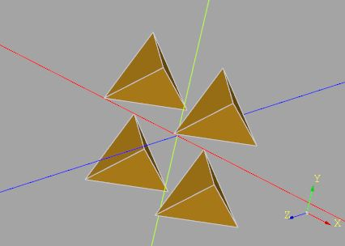

# `uvSphere`

Create a UV sphere.

## Parameters

- `radius`: sphere radius. 
- `widthSegments = 3`: number of horizontal segments.
- `heightSegments = 2`: number of vertical segments.

## Examples 

    from cqmore.polyhedron import uvSphere
    from cqmore import Workplane

    sphere = (Workplane()
                .polyhedron(*uvSphere(radius = 10, widthSegments = 10, heightSegments = 5))
             )

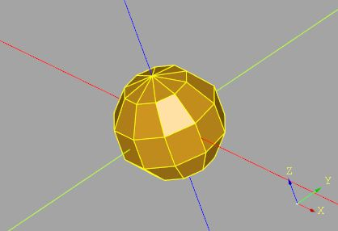

# `tetrahedron`

Create a tetrahedron.

## Parameters

- `radius`: radius of the tetrahedron.
- `detail = 0`: setting this to a value greater than 0 adds vertices making it no longer a tetrahedron.

## Examples 

    from cqmore.polyhedron import tetrahedron
    from cqmore import Workplane

    radius = 1
    polyhedra = Workplane()
    for detail in range(5):
        polyhedra.add(
            Workplane()
                .polyhedron(*tetrahedron(radius, detail))
                .translate((2 * radius * detail, 0, 0))
        )

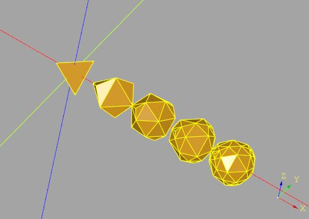

# `hexahedron`

Create a hexahedron.

## Parameters

- `radius`: radius of the hexahedron.
- `detail = 0`: setting this to a value greater than 0 adds vertices making it no longer a hexahedron.

## Examples 

    from cqmore.polyhedron import hexahedron
    from cqmore import Workplane

    radius = 1
    polyhedra = Workplane()
    for detail in range(5):
        polyhedra.add(
            Workplane()
                .polyhedron(*hexahedron(radius, detail))
                .translate((2 * radius * detail, 0, 0))
        )

# `octahedron`

Create a octahedron.

## Parameters

- `radius`: radius of the octahedron.
- `detail = 0`: setting this to a value greater than 0 adds vertices making it no longer a octahedron.

## Examples 

    from cqmore.polyhedron import octahedron
    from cqmore import Workplane

    radius = 1
    polyhedra = Workplane()
    for detail in range(5):
        polyhedra.add(
            Workplane()
                .polyhedron(*octahedron(radius, detail))
                .translate((2 * radius * detail, 0, 0))
        )

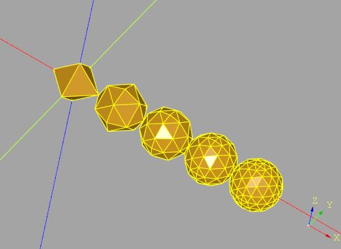

# `dodecahedron`

Create a dodecahedron.

## Parameters

- `radius`: radius of the dodecahedron.
- `detail = 0`: setting this to a value greater than 0 adds vertices making it no longer a dodecahedron.

## Examples 

    from cqmore.polyhedron import dodecahedron
    from cqmore import Workplane

    radius = 1
    polyhedra = Workplane()
    for detail in range(5):
        polyhedra.add(
            Workplane()
                .polyhedron(*dodecahedron(radius, detail))
                .translate((2 * radius * detail, 0, 0))
        )

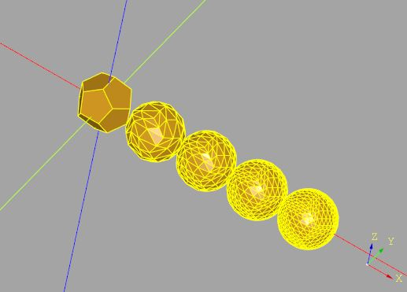

# `icosahedron`

Create a icosahedron.

## Parameters

- `radius`: radius of the icosahedron.
- `detail = 0`: setting this to a value greater than 0 adds vertices making it no longer a icosahedron.

## Examples 

    from cqmore.polyhedron import icosahedron
    from cqmore import Workplane

    radius = 1
    polyhedra = Workplane()
    for detail in range(5):
        polyhedra.add(
            Workplane()
                .polyhedron(*icosahedron(radius, detail))
                .translate((2 * radius * detail, 0, 0))
        )

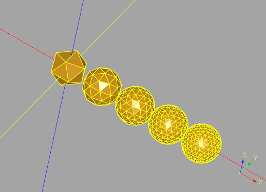

# `star`

Create a star. Default to a pentagram.

## Parameters

- `outerRadius = 1`: the outer radius of the star. 
- `innerRadius = 0.381966`: the inner radius of the star.
- `height = 0.5`: the star height.
- `n = 5`: the burst number.

## Examples 

    from cqmore import Workplane
    from cqmore.polyhedron import star

    polyhedron = Workplane().polyhedron(*star())

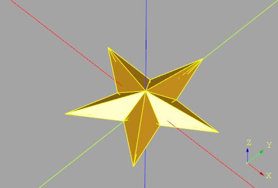

# `gridSurface`

Create a surface with a coordinate meshgrid.

## Parameters

- `points`: a coordinate meshgrid.
- `thickness = 0`: the amount of being thick (return 2D surface if 0).

## Examples 

    from math import sqrt, cos, radians
    from cqmore import Workplane
    from cqmore.polyhedron import gridSurface

    def ripple(x, y):
        n = radians(sqrt(x ** 2 + y ** 2))
        return (x, y, 30 * (cos(n) + cos(3 * n)))

    min_value = -200
    max_value = 200
    step = 10
    thickness = 5

    points = [[
            ripple(x, y) 
        for y in range(min_value, max_value, step)
    ] for x in range(min_value, max_value, step)]

    sf = Workplane().polyhedron(*gridSurface(points, thickness))

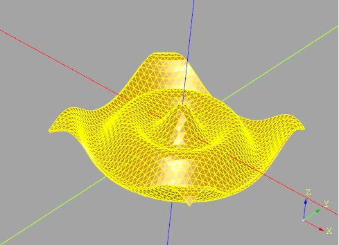

# `superellipsoid`

Create a [superellipsoid](https://en.wikipedia.org/wiki/Superellipsoid).

## Parameters

- `e`: the east-west parameter.
- `n`: the north-south parameter.
- `widthSegments = 3`: number of horizontal segments.
- `heightSegments = 2`: number of vertical segments.

## Examples 

    from cqmore import Workplane
    from cqmore.polyhedron import superellipsoid

    r = Workplane().polyhedron(*superellipsoid(2.5, .25, widthSegments = 24, heightSegments = 12))

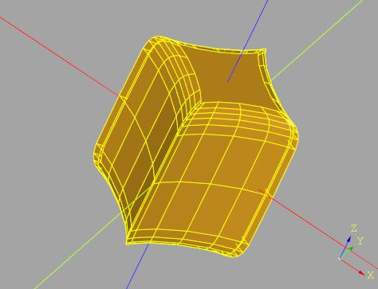

# `polarZonohedra`

Create a [polar zonohedra](https://mathworld.wolfram.com/PolarZonohedron.html).

## Parameters

- `n`: n equal rhombs surrounding one vertex. (rotational symmetry).
- `theta = 35.5`: the pitch angle of the edges.

## Examples 

    from cqmore.polyhedron import polarZonohedra
    from cqmore import Workplane

    pz = Workplane().polyhedron(*polarZonohedra(8, 45))

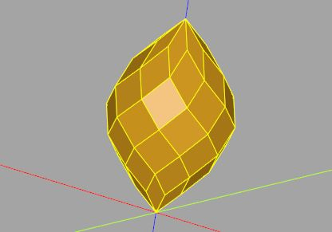

# `hull`

Create a convex hull through the provided points. 

## Parameters

- `points`: a list of 3D points. 

## Examples 

    from cqmore import Workplane
    from cqmore.polyhedron import hull

    points = (
        (50, 50, 50),
        (50, 50, 0),
        (-50, 50, 0),
        (-50, -50, 0),
        (50, -50, 0),
        (0, 0, 50),
        (0, 0, -50)
    )

    convex_hull = Workplane().polyhedron(*hull(points))

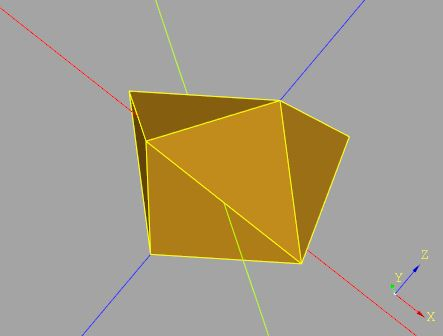

# `sweep`

Create a swept polyhedron.

## Parameters

- `profiles`: list of profiles.
- `closeIdx`: setting it to a value >= 0 creates faces between the first and last profile. The value decides which index of the last profile is connected to the first index of the first profile.

## Examples 

    from cqmore import Workplane
    from cqmore.polyhedron import sweep

    profiles = [
        [(10, 0, 0), (10, 0, 10), (20, 0, 10), (20, 0, 0)],
        [(0, 10, 0), (0, 10, 10), (0, 20, 10), (0, 20, 0)],
        [(-10, 0, 0), (-10, 0, 10), (-20, 0, 10), (-20, 0, 0)],
        [(0, -10, 0), (0, -10, 10), (0, -20, 10), (0, -20, 0)]
    ]

    r = Workplane().polyhedron(*sweep(profiles))

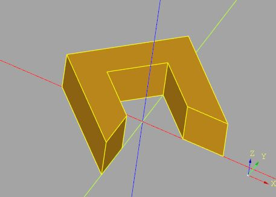

    from cqmore import Workplane
    from cqmore.polyhedron import sweep

    profiles = [
        [(10, 0, 0), (10, 0, 10), (20, 0, 10), (20, 0, 0)],
        [(0, 10, 0), (0, 10, 10), (0, 20, 10), (0, 20, 0)],
        [(-10, 0, 0), (-10, 0, 10), (-20, 0, 10), (-20, 0, 0)],
        [(0, -10, 0), (0, -10, 10), (0, -20, 10), (0, -20, 0)]
    ]

    r = Workplane().polyhedron(*sweep(profiles, closeIdx = 0))

