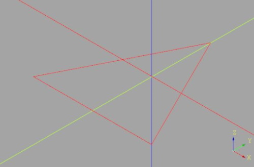
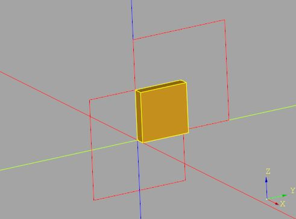
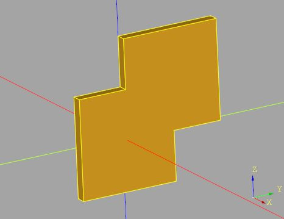
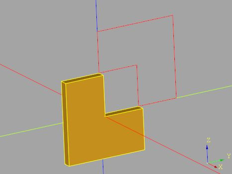
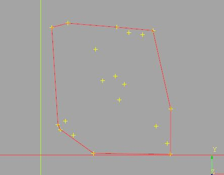
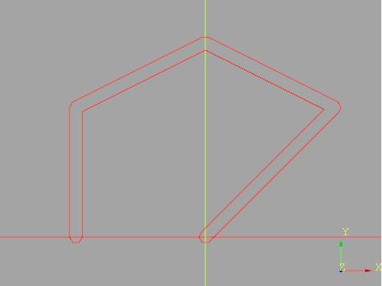
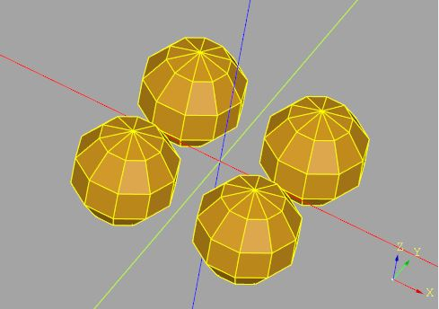
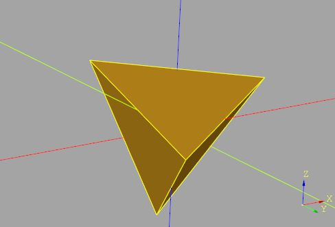
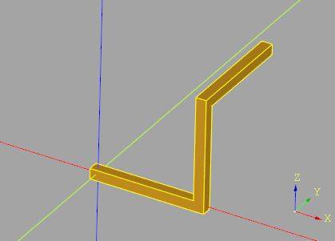

# `cqmore.Workplane`

Define plugins. You may simply use `cqmore.Workplane` to replace `cadquery.Workplane`. For example:

    from cqmore import Workplane

    result = (Workplane()
                .rect(10, 10)
                .makePolygon(((-2, -2), (2, -2), (2, 2), (-2, 2)))
                .extrude(1)
             )

You may also attach methods of `cqmore.Workplane` to `cadquery.Workplane`, such as:

    from cadquery import Workplane
    import cqmore
    cqmore.extend(Workplane)

    result = (Workplane()
                .rect(10, 10)
                .makePolygon(((-2, -2), (2, -2), (2, 2), (-2, 2)))
                .extrude(1)
            )

## 2D Operations

 Signature | Description
--|--
[`makePolygon(points[,forConstruction])`](workplane.md#makepolygon) | Make a multiple sided wire through the provided points.
[`intersect2D(toIntersect)`](workplane.md#intersect2d) | Intersect the provided wire from the current wire. 
[`union2D(toUnion)`](workplane.md#union2d) | Union the provided wire from the current wire. 
[`cut2D(toCut)`](workplane.md#cut2d) | Cut the provided wire from the current wire. 
[`hull2D(points[,forConstruction])`](workplane.md#hull2d) | Create a convex hull through the provided points. 
[`polylineJoin2D(points,join[,forConstruction])`](workplane.md#polyline_join2D) | Place a join on each point. Hull each pair of joins and union all convex hulls.

## 3D Operations

 Signature | Description
--|--
[`uvSphere(radius,[rings,combine,clean])`](workplane.md#uvsphere) | Create a UV sphere.
[`polyhedron(points,faces[,combine,clean])`](workplane.md#polyhedron) | Create any polyhedron through 3D points(vertices) and faces that enclose the solid.
[`surface(points,[thickness,combine,clean])`](workplane.md#surface) | Create a surface with a coordinate meshgrid.
[`hull(points[,combine,clean])`](workplane.md#hull) | Create a convex hull through the provided points. 
[`polylineJoin(points,join[,combine,clean])`](workplane.md#polyline_join) | Place a join on each point. Hull each pair of joins and union all convex hulls.

----

# `makePolygon`

Make a multiple sided wire through the provided points. 

## Parameters

- `points`: the list of x,y points of the polygon.
- `forConstruction = False`: should the new wires be reference geometry only?

## Examples

    from cqmore import Workplane

    triangle = Workplane().makePolygon(((-2, -2), (2, -2), (0, 2))) 

# `intersect2D`

Intersect the provided wire from the current wire. 

## Parameters

- `toIntersect`: a wire object, or a CQ object having a wire – object to intersect.

## Examples

    from cqmore import Workplane

    r1 = Workplane('YZ').rect(10, 10)
    r2 = Workplane('YZ').center(5, 5).rect(10, 10)
    intersected = r1.intersect2D(r2).extrude(1)

# `union2D`

Union the provided wire from the current wire. 

## Parameters

- `toUnion`: a wire object, or a CQ object having a wire – object to union.       

## Examples 

    from cqmore import Workplane

    r1 = Workplane('YZ').rect(10, 10)
    r2 = Workplane('YZ').center(5, 5).rect(10, 10)
    unioned = r1.union2D(r2).extrude(1)

# `cut2D`

Cut the provided wire from the current wire. 

## Parameters

- `toCut`: a wire object, or a CQ object having a wire – object to cut.       

## Examples 

    from cqmore import Workplane

    r1 = Workplane('YZ').rect(10, 10)
    r2 = Workplane('YZ').center(5, 5).rect(10, 10)
    cutted = r1.cut2D(r2).extrude(1)

# `hull2D`

Create a convex hull through the provided points. 

## Parameters

- `points`: the list of x, y points. 
- `forConstruction = False`: should the new wires be reference geometry only?

## Examples

    from random import random
    from cqmore import Workplane

    points = [(random(), random()) for i in range(20)]

    pts = Workplane().polyline(points).vertices()
    convex_hull = Workplane().hull2D(points)

# `polylineJoin2D`

Place a join on each point. Hull each pair of joins and union all convex hulls.

## Parameters

- `points`: the list of x, y points. 
- `join`: the wire as a join.
- `forConstruction = False`: should the new wires be reference geometry only?

## Examples 

    from cqmore import Workplane

    points = [(0, 0), (10, 10), (0, 15), (-10, 10), (-10, 0)]
    polyline = Workplane().polylineJoin2D(points, Workplane().polygon(6, 1))

# `uvSphere`

Create a UV sphere.

## Parameters

- `radius`: sphere radius.
- `rings = 2`: number of horizontal segments.
- `combine = True`: should the results be combined with other solids on the stack (and each other)?
- `clean = True`: call `clean()` afterwards to have a clean shape.

## Examples 

    from cqmore import Workplane

    spheres = (Workplane()
                  .rect(5, 5, forConstruction = True)
                  .vertices()
                  .uvSphere(2, rings = 5)
              )

# `polyhedron`

Create any polyhedron with 3D points(vertices) and faces that enclose the solid. Each face contains the indices (0 based) of 3 or more points from the `points`.

## Parameters

- `points`: a list of 3D points(vertices).
- `faces`: face indices to fully enclose the solid. When looking at any face from the outside, the face must list all points in a counter-clockwise order.
- `combine = True`: should the results be combined with other solids on the stack (and each other)?
- `clean = True`: call `clean()` afterwards to have a clean shape.

## Examples 

    from cqmore import Workplane

    points = ((5, -5, -5), (-5, 5, -5), (5, 5, 5), (-5, -5, 5))
    faces = ((0, 1, 2), (0, 3, 1), (1, 3, 2), (0, 2, 3))
    tetrahedron = Workplane().polyhedron(points, faces)

# `surface`

Create a surface with a coordinate meshgrid.

## Parameters

- `points`: a coordinate meshgrid.
- `thickness = 0`: the amount of being thick (return 2D surface if 0).
- `combine = True`: should the results be combined with other solids on the stack (and each other)?
- `clean = True`: call `clean()` afterwards to have a clean shape.

## Examples 

    from cqmore import Workplane

    def paraboloid(x, y):
        return (x, y, ((y ** 2) - (x ** 2)) / 4)

    min_value = -30
    max_value = 30
    step = 5
    thickness = 0.5

    points = [[
            paraboloid(x / 10, y / 10) 
        for x in range(min_value, max_value, step)
    ] for y in range(min_value, max_value, step)]

    sf = Workplane().surface(points, thickness)

# `hull`

Create a convex hull through the provided points. 

## Parameters

- `points`: a list of 3D points. 
- `combine = True`: should the results be combined with other solids on the stack (and each other)?
- `clean = True`: call `clean()` afterwards to have a clean shape.

## Examples

    from cqmore import Workplane

    points = (
        (50, 50, 50),
        (50, 50, 0),
        (-50, 50, 0),
        (-50, -50, 0),
        (50, -50, 0),
        (0, 0, 50),
        (0, 0, -50)
    )

    convex_hull = Workplane().hull(points)

# `polylineJoin`

Place a join on each point. Hull each pair of joins and union all convex hulls.

## Parameters

- `points`: the list of x, y points. 
- `join`: the sold as a join.
- `combine = True`: should the results be combined with other solids on the stack (and each other)?
- `clean = True`: call `clean()` afterwards to have a clean shape.

## Examples 

    from cqmore import Workplane

    polyline = (Workplane()
                    .polylineJoin(
                        [(0, 0, 0), (10, 0, 0), (10, 0, 10), (10, 10, 10)], 
                        Workplane().box(1, 1, 1)
                    )
                )

